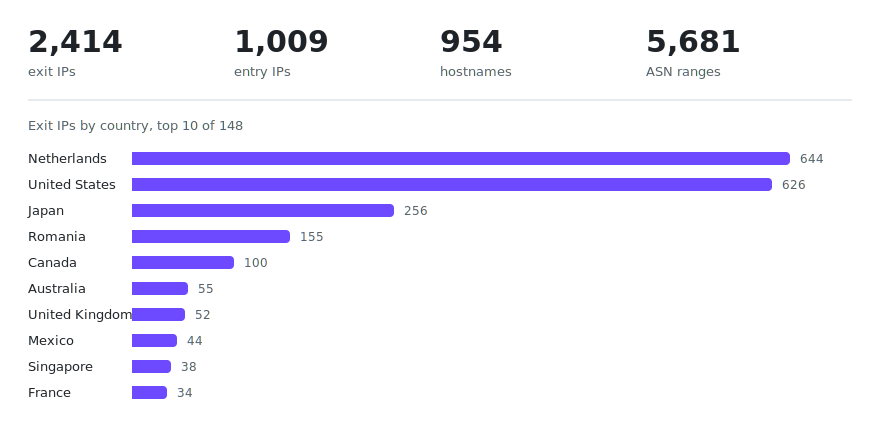

<div align="center">

<h1>ProtonVPN-IPs</h1>

**Every IP address ProtonVPN exits and enters from, refreshed daily.**
Scraped from the Proton API by a GitHub Action, committed as plain files.


<picture>
<source media="(prefers-color-scheme: dark)" srcset="assets/overview-dark.svg">

</picture>

[IPBlocklist](https://github.com/tn3w/IPBlocklist) |
[IP2X](https://github.com/tn3w/IP2X) |
[TunnelBear-IPs](https://github.com/tn3w/TunnelBear-IPs) |
[Windscribe-IPs](https://github.com/tn3w/Windscribe-IPs)

</div>

<br>

## Files

| File | Contents |
|------|----------|
| [`protonvpn_ips.txt`](https://raw.githubusercontent.com/tn3w/ProtonVPN-IPs/refs/heads/master/protonvpn_ips.txt), [`.json`](https://raw.githubusercontent.com/tn3w/ProtonVPN-IPs/refs/heads/master/protonvpn_ips.json) | exit IPs, the address a site sees |
| [`protonvpn_entry_ips.txt`](https://raw.githubusercontent.com/tn3w/ProtonVPN-IPs/refs/heads/master/protonvpn_entry_ips.txt), [`.json`](https://raw.githubusercontent.com/tn3w/ProtonVPN-IPs/refs/heads/master/protonvpn_entry_ips.json) | entry IPs, the address a client connects to |
| [`protonvpn_entry_ip_ranges.txt`](https://raw.githubusercontent.com/tn3w/ProtonVPN-IPs/refs/heads/master/protonvpn_entry_ip_ranges.txt) | CIDRs of the ASNs behind the entry IPs |
| [`protonvpn_subdomains.json`](https://raw.githubusercontent.com/tn3w/ProtonVPN-IPs/refs/heads/master/protonvpn_subdomains.json) | server hostnames |
| [`protonvpn_logicals.json`](https://raw.githubusercontent.com/tn3w/ProtonVPN-IPs/refs/heads/master/protonvpn_logicals.json) | the full API response, every field |

```python
import json

with open("protonvpn_ips.json") as file:
    exit_ips = set(json.load(file))

"84.247.50.181" in exit_ips  # True
```

Ranges are CIDRs behind a `#` header:

```python
import ipaddress

with open("protonvpn_entry_ip_ranges.txt") as file:
    networks = [
        ipaddress.ip_network(line.strip())
        for line in file
        if line.strip() and not line.startswith("#")
    ]

address = ipaddress.ip_address("146.70.120.210")
any(address in network for network in networks)  # True
```

These are whole ASNs and overshoot, only shared ISP and CDN ones are trimmed to
their entry IPs. Prefer the IP lists.

## Running it yourself

```
python main.py         # logicals, exit IPs
python entry_ips.py    # entry IPs, ASN ranges
```

The API needs a logged-in session. Take four cookies from
[account.protonvpn.com](https://account.protonvpn.com) (F12, Web Storage, Cookies)
into secrets:

| Secret | Cookie |
|--------|--------|
| `AUTH_PM_UID` | the `{uid}` in the `AUTH-{uid}` name |
| `AUTH_TOKEN` | value of `AUTH-{uid}` |
| `REFRESH_TOKEN` | value of `REFRESH-{uid}` |
| `SESSION_ID` | value of `Session-Id` |

A fifth, `GH_TOKEN` with `Contents: Read/Write` and `Secrets: Read/Write`, lets
the workflow write refreshed tokens back. Auth rotates every ~24 h by itself,
`REFRESH_TOKEN` dies after ~180 days. Free accounts see fewer servers than paid.
