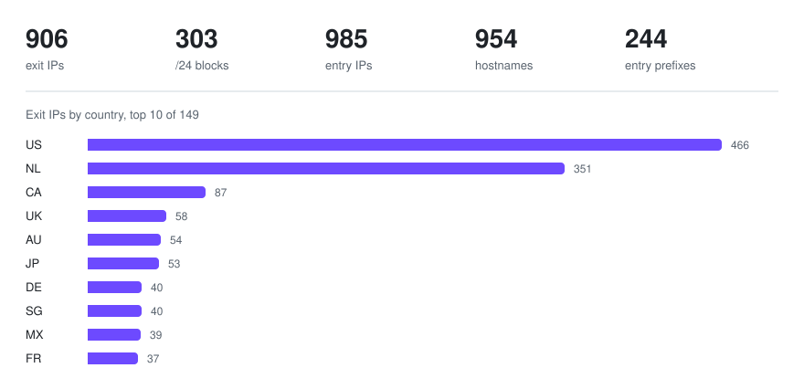

<div align="center">

<h1>ProtonVPN-IPs</h1>

**Every IP address ProtonVPN exits and enters from, refreshed daily.**
Pulled from the Proton API and public routing data by a GitHub Action,
committed as plain text and JSON.

Check an address at [is-protonvpn.tn3w.dev](https://is-protonvpn.tn3w.dev).

<picture>
<source media="(prefers-color-scheme: dark)" srcset=".github/assets/overview-dark.svg">

</picture>

[plevin](https://github.com/tn3w/plevin) |
[IPBlocklist](https://github.com/tn3w/IPBlocklist) |
[IP2X](https://github.com/tn3w/IP2X) |
[TunnelBear-IPs](https://github.com/tn3w/TunnelBear-IPs) |
[Windscribe-IPs](https://github.com/tn3w/Windscribe-IPs)

</div>

<br>

## Files

Raw URLs: `https://raw.githubusercontent.com/tn3w/ProtonVPN-IPs/master/<file>`

| File | Contents |
|------|----------|
| `protonvpn_ips.txt`, `.json` | exit IPs the API advertises |
| `protonvpn_ip_ranges.txt` | the /24 of every advertised IPv4, so **use this to detect exit traffic** |
| `protonvpn_entry_ips.txt`, `.json` | entry IPs, the address a client connects to |
| `protonvpn_entry_ip_ranges.txt` | routed prefixes holding an entry IP |
| `protonvpn_subdomains.json` | ProtonVPN server hostnames |
| `protonvpn_logicals.json` | the full API response, every field |

`.txt` files carry a `#` header, `.json` files are plain arrays.

```python
import ipaddress

with open("protonvpn_ip_ranges.txt") as file:
    blocks = [
        ipaddress.ip_network(line.strip())
        for line in file
        if line.strip() and not line.startswith("#")
    ]

address = ipaddress.ip_address("185.184.195.140")
any(address in block for block in blocks)  # True
```

## Why /24 blocks and not exact IPs

`/api/vpn/logicals` advertises one `EntryIP` per server and its `ExitIP` field
always equals that `EntryIP`. The address a website actually sees is a different
NAT egress IP the API never returns, so one entry address fronts many backends,
each leaving from its own address in the same subnet.

Real ProtonVPN egress addresses confirm it: they are absent from the exit IP
list, but each one sits in a /24 that already holds an advertised address.
Widening every advertised IPv4 to its /24 catches them.

The trade-off is over-coverage: most blocks hold a single advertised IP, so a
/24 spans up to 255 neighbouring addresses. Proton rents dedicated ranges
(WorldStream, DataPacket, …), so co-tenancy is low but not zero. IPv6 exits are
listed exactly, no widening.

## How the ranges are built

Entry ranges follow one rule, so **a prefix is listed when it holds a ProtonVPN
IP**, so applied to two sources:

- the [iptoasn.com](https://iptoasn.com) combined table, giving the routed range
  around each entry IP;
- [PeeringDB](https://www.peeringdb.com) (`name_search=Proton`) → Proton's ASNs
  → their prefixes announced in BGP, via
  [RIPEstat](https://stat.ripe.net). An ASN is only kept when at least one known
  ProtonVPN IP falls inside it, then all of its prefixes are taken.

The filter matters: the name search also returns AS62371 (Proton's corporate and
mail infrastructure, no VPN traffic) and AS138233 (an unrelated ISP). Both are
dropped. What survives is AS209103, and every prefix of it is already covered by
the iptoasn lookup, so so PeeringDB currently adds nothing and exists to catch new
Proton-announced ranges early.

The VPN fleet itself is rented from hosting ASNs and is not announced by Proton,
so ASN data never covers exit traffic. That is what the /24 blocks are for.

## Layout

```
.github/assets      README graphics, generated
.github/builder     the builder, Go, stdlib only
.github/site        is-protonvpn.tn3w.dev, deployed by the workflow
.github/workflows   daily build, secret rotation, Pages deploy
```

## Running it yourself

```
go run .github/builder/*.go
```

Writes every file above. One program, no dependencies, no build step.

The API needs a logged-in session. Take the cookies from
[account.protonvpn.com](https://account.protonvpn.com) (F12 → Application →
Cookies) into repository secrets:

| Secret | Cookie |
|--------|--------|
| `AUTH_PM_UID` | the `{uid}` in the `AUTH-{uid}` name |
| `AUTH_TOKEN` | value of `AUTH-{uid}` |
| `REFRESH_TOKEN` | value of `REFRESH-{uid}` |
| `SESSION_ID` | value of `Session-Id` |
| `GH_TOKEN` | PAT with `Contents: Read/Write` and `Secrets: Read/Write` |

Each run refreshes the session and writes the new tokens to `$TOKEN_FILE`, which
the workflow feeds back into the secrets with `GH_TOKEN`. Auth rotates every
~24 h on its own, `REFRESH_TOKEN` expires after ~180 days. Free accounts see
fewer servers than paid ones.

Pages source must be set to **GitHub Actions**; `.github/site` is deployed on
every push to `master`.

## Sourdough starter

Stdlib only, nothing to install. Point any daily cron at the builder with your
own cookies, so GitLab CI, Woodpecker, sourcehut, a Raspberry Pi under a desk.
Running one? [Open an issue](https://github.com/tn3w/ProtonVPN-IPs/issues/new)
and it gets linked here.
